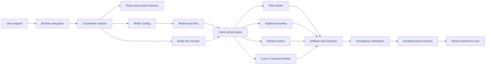
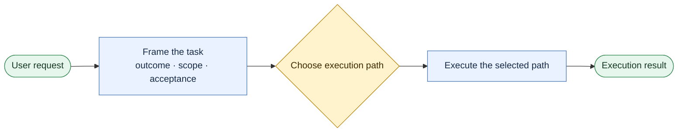
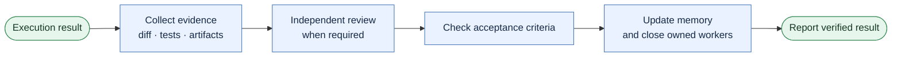

# Brichan workflow overview

This document explains the core Brichan workflow: how a user request becomes
bounded work, how independent workers are coordinated, and how completion is
verified. It is an overview, not runtime policy. The canonical rules live in
[`policy/`](policy/).

## Mental model

```text
User
  └── Brichan coordinator
        ├── planning worker
        ├── implementation worker
        ├── review worker
        └── research or scan worker
```

- The **user** owns goals, priorities, trade-offs, and final authority.
- The **coordinator** holds context, defines bounded tasks, routes work, checks
  evidence, and maintains durable project state.
- **Workers** are independent Codex or Claude sessions created through Herdr.
  They perform focused planning, implementation, testing, research, or review.

Brichan is the delegated coordinator. It is not the human user, and a worker
reporting `done` is never sufficient proof that the task is complete.

## Architecture at a glance



The monitor consumes Herdr JSON and terminal text. It does not use screenshots,
send input to workers, or treat scheduling state as completion evidence.

## Two operating modes

| Mode | Entry point | Coordinator runtimes | Configuration and memory |
| --- | --- | --- | --- |
| Source checkout | `bin/brichan` | Codex and Claude | Repository `config/`, `docs/policy/`, and `projects/` |
| Installed project | Installed `brichan` command | Codex | Target `.brichan/` managed state |

Mode is selected by the launcher:

- Repository wrappers call explicit checkout entrypoints.
- Installed console scripts always use installed-project behavior.
- The current directory, `BRICHAN_ROOT`, or a target-owned wrapper cannot move
  an installed command into checkout mode.

In checkout mode, small and tightly coupled work may be handled directly;
delegation is used when it adds useful specialization, parallelism, or
independent judgment. In installed-project mode, every repository-changing
task must use the complete `plan` → `implement` → independent `review` worker
lifecycle.

## End-to-end workflow

The workflow is easier to understand as two connected parts. Part 1 decides
how the request should be executed. Part 2 decides whether the result is ready
to report as complete.

### Part 1 — From request to execution



The execution path is selected using this compact map:

| Request type | Execution path |
| --- | --- |
| Read-only | Answer or inspect directly |
| Small checkout change | Implement directly |
| Installed-project change | Plan worker → approve plan → implementation worker |
| Checkout work that benefits from delegation | Plan worker → approve plan → implementation worker |

### Part 2 — From evidence to completion



Exceptions do not create crossing lines in the diagram:

| Condition | Next step |
| --- | --- |
| Repository did not change | Report the result directly |
| Independent review is not required | Skip review and check acceptance criteria |
| Review fails | Fix findings, then collect fresh evidence |
| Acceptance criteria fail | Fix the result, then collect fresh evidence |

Only the green exit represents a result that is ready to report as complete.

## How the workflow works

### 1. Define the task

The coordinator converts the request into an objective, scope, deliverables,
acceptance criteria, constraints, permissions, and escalation conditions.

### 2. Route and launch workers

Named routes—`plan`, `implement`, `review`, and `scan`—resolve to a runtime,
model, and reasoning effort. Workers are launched as independent main-agent
sessions through Herdr, with `brichan-` names and bounded task packets.

### 3. Observe without controlling

Brichan observes workers through the read-only monitor. Herdr states such as
`working`, `idle`, `blocked`, or `done` are scheduling signals only. When
terminal output may be incomplete, the coordinator reads the declared durable
evidence files instead.

### 4. Resolve techstack context when the project opts in

When the target project has a regular, non-symlink `techstacks/README.md` at
its top-level Git root, the coordinator resolves it and publishes one Snapshot
before writing the packet:

```bash
brichan techstacks resolve --project-root <root> --input-json <path> --snapshot-directory <dir>
brichan techstacks verify --project-root <root> --snapshot-json <path> --as-of <YYYY-MM-DD>
```

The authorized Snapshot directory is mode-specific:
`projects/<project-slug>/handoffs/<TASK-ID>/snapshots` in checkout mode, and
`.brichan/project-memory/techstack-snapshots/<TASK-ID>` in an installed
project. Publication derives the digest-bearing filename itself, verifies it,
and retries at most three drifted observations. The packet and receipt carry
only the selected artifact pointer, its digest, the selected file pointers, and
the acknowledgement — never rule bodies. A newly discovered path, Context ID or
chain, conflict, or exception need sends the plan back to a plan worker before
acceptance. The normative rules are in
[`policy/techstacks.md`](policy/techstacks.md).

### 5. Verify before completion

The coordinator checks the evidence appropriate to the task:

- Code: diff, tests, contract checks, and known limitations.
- Debugging: reproduction, root cause, fix, and regression coverage.
- Research: direct sources and unresolved uncertainty.
- Review: findings ordered by severity with concrete file evidence.

Material changes require an independent review. A `PASS` verdict is integrated
only after the acceptance criteria and required evidence have also passed.

### 6. Record and clean up

Verified facts are written to durable project memory, not left only in chat.
The coordinator then closes only the idle or completed panes that Brichan
created and reports the outcome, evidence, risks, open decisions, and next step.

## Durable state

Checkout projects store memory under `projects/<slug>/`:

- `overview.md` — stable facts and scope.
- `current-state.md` — current status and next actions.
- `tasks.md` — active work and ownership.
- `decisions.md` — accepted decisions and rationale.
- `references.md` — source and evidence pointers.

Installed projects use the same concepts under `.brichan/project-memory/`.
Task dossiers and handoff receipts preserve lifecycle, evidence, review, and
cleanup records for tracked delegated work.

## Core invariants

- Workers are independent sessions controlled through Herdr, never native
  runtime sub-agents.
- Codex native delegation remains disabled.
- Installed launchers do not execute target-owned Brichan wrappers.
- Existing user-owned instructions, provider configuration, and skills are not
  overwritten.
- Monitoring is read-only, and worker scheduling state is not proof.
- Completion requires checked acceptance criteria and evidence.
- Remote actions, publishing, deployment, permission broadening, and secrets
  require explicit user authorization.

For implementation boundaries, see
[`architecture/repository-layout.md`](architecture/repository-layout.md). For
the normative coordination loop, see
[`policy/operating-principles.md`](policy/operating-principles.md).
